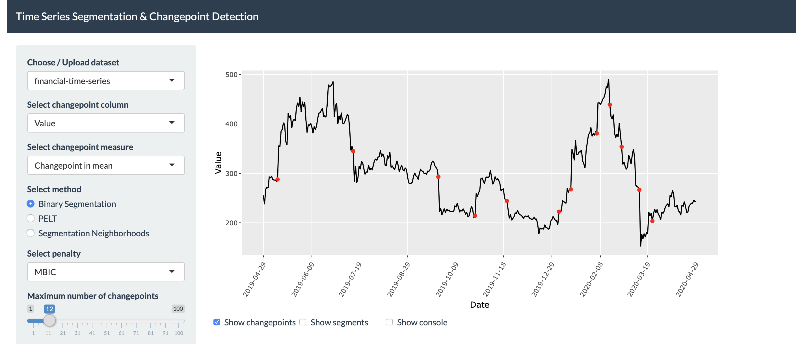

 

## Time Series Segmentation & Changepoint Detection

### What is it about?

An R/Shiny app for time-series segmentation and changepoint detection tasks. The app acts as a front-end for R packages such as the magnificent [changepoint](https://cran.r-project.org/web/packages/changepoint/index.html) package.

The app will also be [online](https://ts-changepoint-detection.medoid.ai/) for a limited time and you can try it!

For more information on the parameters and algorithms currently included in the app please read the following [paper](https://www.researchgate.net/publication/264485551_Changepoint_An_R_Package_for_Changepoint_Analysis) by Killick et al. For an overview of changepoint packages that may be included in the future please see the following [page](https://lindeloev.github.io/mcp/articles/packages.html).

<kbd>

</kbd>

### How do I install it?

You can run the application locally using [R](https://www.r-project.org/) and/or [RStudio](https://rstudio.com/) IDE.

or

### The people behind it

The following members of our team were involved in developing the initial release of this app:

* [Panagiotis Papaemmanouil](https://github.com/panagiotis-papaemmanouil)
* [Lazaros Paschalidis](https://github.com/lazarospa)
* [Efstathios Chatzikyriakidis](https://github.com/echatzikyriakidis)
* [Anestis Fachantidis](https://github.com/anestisfa)

### Can I contribute?

Of course, the project is [Free Software](https://www.gnu.org/philosophy/free-sw.en.html) and you can contribute to it!

### What license do you use?

See our [LICENSE](LICENSE) for more details.
